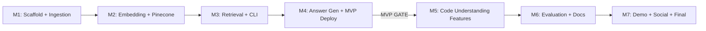

# Implementation Plan

## Overview
LegacyLens is a CLI-first RAG tool that makes the LAPACK Fortran library queryable via natural language. Built with Python/FastAPI, Voyage Code 2 embeddings, Pinecone vector DB, and Claude Haiku 4.5 for answer generation. Deployed on Fly.io with Swagger UI for web demo. Designed with a pluggable chunker interface for future COBOL support and MCP server upgrade path.

**Timeline:** MVP in 24 hours, Final in 48 hours.

## Milestones

### M1: Project Scaffold + LAPACK Ingestion
- **Scope:** Initialize Python project (pyproject.toml, FastAPI app, CLI skeleton). Download LAPACK source. Build the Fortran regex chunker with metadata extraction. Implement the pluggable `BaseChunker` interface and `ChunkerRegistry`.
- **Acceptance Criteria:**
  - [ ] Python project with dependencies installable (`pip install -e .`)
  - [ ] LAPACK `SRC/` and `BLAS/SRC/` files discovered and filtered (.f/.f90)
  - [ ] Regex chunker produces Chunk objects with all metadata fields (subroutine_name, calls, parameters, purpose, precision, file_path, line numbers)
  - [ ] Enriched content includes NL summary prefix
  - [ ] BaseChunker ABC and ChunkerRegistry implemented
  - [ ] Unit tests for chunker on 5+ representative LAPACK files (small, medium, large)
- **Dependencies:** None
- **Complexity:** Medium
- **Target:** Hours 0-6

### M2: Embedding + Pinecone Storage
- **Scope:** Set up Pinecone index. Integrate Voyage Code 2 SDK. Build ingestion pipeline: chunks → embeddings → Pinecone upsert with metadata. Run full LAPACK ingestion.
- **Acceptance Criteria:**
  - [ ] Pinecone index created with correct dimension (1536) and metadata schema
  - [ ] Voyage Code 2 embeds chunks in batches (128 per call)
  - [ ] All LAPACK chunks upserted to Pinecone with metadata
  - [ ] 100% file coverage verified
  - [ ] Ingestion completes in <5 minutes for 10K+ LOC
- **Dependencies:** M1
- **Complexity:** Medium
- **Target:** Hours 6-10

### M3: Retrieval Pipeline + Basic CLI
- **Scope:** Build the core retrieval function (embed query → Pinecone search → assemble context). Create CLI with typer for natural language queries. Display results with code snippets, file/line refs, and relevance scores.
- **Acceptance Criteria:**
  - [ ] Query embedding uses same Voyage Code 2 model
  - [ ] Top-k retrieval returns ranked chunks with similarity scores
  - [ ] CLI accepts natural language input, displays formatted results
  - [ ] Results show: code snippet, file path, line numbers, relevance score
  - [ ] `legacylens view <file_path>` command to drill down into full file context from a result
  - [ ] Test with 6 PRD test scenarios — verify relevant results returned
- **Dependencies:** M2
- **Complexity:** Medium
- **Target:** Hours 10-14

### M4: Answer Generation + MVP Deploy
- **Scope:** Integrate Claude Haiku 4.5 for answer synthesis. Stream responses in CLI. Deploy FastAPI to Fly.io with Swagger UI. Verify all MVP requirements met.
- **Acceptance Criteria:**
  - [ ] LLM receives retrieved chunks as context and generates explanations
  - [ ] Streaming responses in CLI (tokens appear as generated)
  - [ ] FastAPI endpoints: POST /query, GET /health
  - [ ] Swagger UI accessible at public Fly.io URL
  - [ ] CLI can target both local and deployed API
  - [ ] All 9 MVP requirements from PRD checked off
  - [ ] Query latency <3 seconds end-to-end
- **Dependencies:** M3
- **Complexity:** Medium
- **Target:** Hours 14-20

**--- MVP GATE (Hour 24) ---**

### M5: Code Understanding Features (4 of 4)
- **Scope:** Implement the 4 confirmed features as distinct CLI commands / API endpoints, all powered by the same retrieval pipeline + specialized prompts.
  - **Code Explanation:** `legacylens explain <function>` — plain-English explanation
  - **Dependency Mapping:** `legacylens deps <function>` — callers/callees from metadata + LLM analysis
  - **Documentation Gen:** `legacylens docgen <function>` — generate structured documentation
  - **Business Logic Extraction:** `legacylens logic <function>` — extract and explain computational rules
- **Acceptance Criteria:**
  - [ ] Each feature has a CLI command and API endpoint
  - [ ] `explain` produces accurate plain-English summaries
  - [ ] `deps` shows call graph (callers + callees) with file references
  - [ ] `docgen` produces structured documentation (purpose, params, returns, algorithm)
  - [ ] `logic` identifies and explains mathematical/business rules
  - [ ] All features work against the deployed API
- **Dependencies:** M4
- **Complexity:** Medium
- **Target:** Hours 20-30

### M6: Polish, Evaluation + Documentation
- **Scope:** Measure retrieval precision against test queries. Write RAG Architecture Doc. Complete AI Cost Analysis. Write Pre-Search Document. Create GitHub README with setup guide.
- **Acceptance Criteria:**
  - [ ] Retrieval precision measured on 10+ test queries, >70% in top-5
  - [ ] RAG Architecture Doc complete (1-2 pages, PRD template)
  - [ ] AI Cost Analysis complete (dev spend + projections at 100/1K/10K/100K users)
  - [ ] Pre-Search Document complete (all 16 sections)
  - [ ] README with setup guide, architecture overview, deployed link
  - [ ] Failure modes documented
- **Dependencies:** M5
- **Complexity:** Small
- **Target:** Hours 30-40

### M7: Demo Video + Social Post + Final Deploy
- **Scope:** Record 3-5 min demo video showing queries, retrieval, answer generation, and code understanding features. Post on X/LinkedIn. Final deployment check. Upgrade LLM to Sonnet for demo if desired.
- **Acceptance Criteria:**
  - [ ] Demo video (3-5 min) recorded and uploaded
  - [ ] Video shows: query flow, retrieval results, answer generation, at least 2 code understanding features
  - [ ] Social post published (X or LinkedIn, tag @GauntletAI)
  - [ ] Deployed application verified accessible
  - [ ] All submission requirements from PRD checked off
- **Dependencies:** M6
- **Complexity:** Small
- **Target:** Hours 40-48

**--- FINAL GATE (Hour 48) ---**

## Milestone Dependencies

## Tech Stack Summary
| Layer | Choice | Research Doc |
|-------|--------|-------------|
| Codebase | LAPACK (Fortran) | Docs/Presearch/Q1_requirements_scope.md |
| Backend | Python / FastAPI | Docs/Presearch/Q1_requirements_scope.md |
| Embeddings | Voyage Code 2 (1536 dim) | Docs/Presearch/Q2_embedding_model.md |
| Vector DB | Pinecone (managed, free tier) | Docs/Presearch/Q1_requirements_scope.md |
| LLM | Claude Haiku 4.5 | Docs/Presearch/Q2_llm_answer_generation.md |
| Framework | Custom pipeline (no framework) | Docs/Presearch/Q2_rag_framework.md |
| Chunking | Regex parser, one chunk/file | Docs/Presearch/Q2_chunking_strategy.md |
| CLI | Python / typer | Docs/Presearch/Q1_requirements_scope.md |
| Deployment | Fly.io (FastAPI) | Docs/Presearch/Q1_requirements_scope.md |
| Web Demo | FastAPI Swagger UI | Docs/Presearch/Q1_requirements_scope.md |

## Critical Path
M1 → M2 → M3 → M4 is the critical path to MVP. Each milestone is sequential — no parallelism possible until M4 is complete. This means:
- **Hours 0-20 are make-or-break.** Any delay in M1-M4 directly delays MVP.
- **M5-M7 have slight buffer** — code understanding features use the same pipeline, just different prompts.
- **If behind schedule at hour 14:** Skip streaming in CLI, deploy with basic request/response, add streaming post-MVP.
- **If behind schedule at hour 20:** Deploy with 2 code understanding features instead of 4, add remaining in M6 window.
